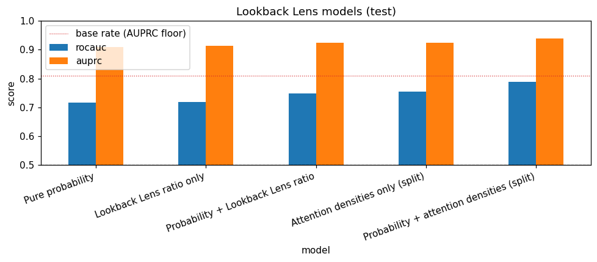
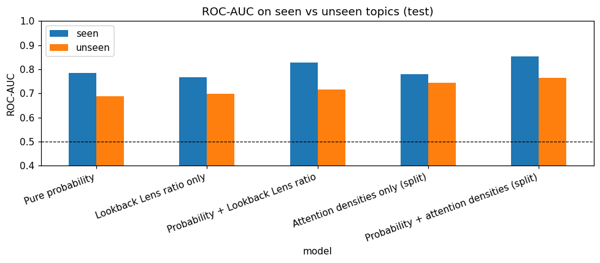
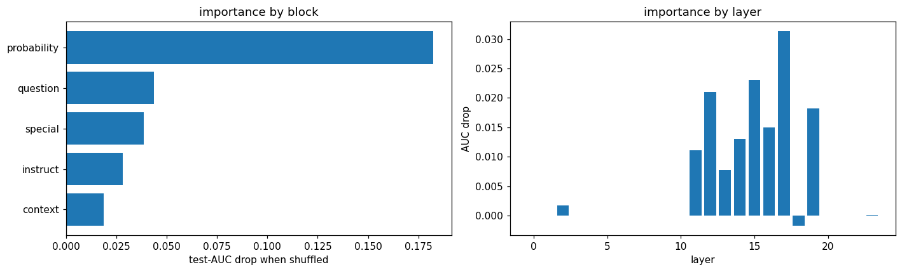
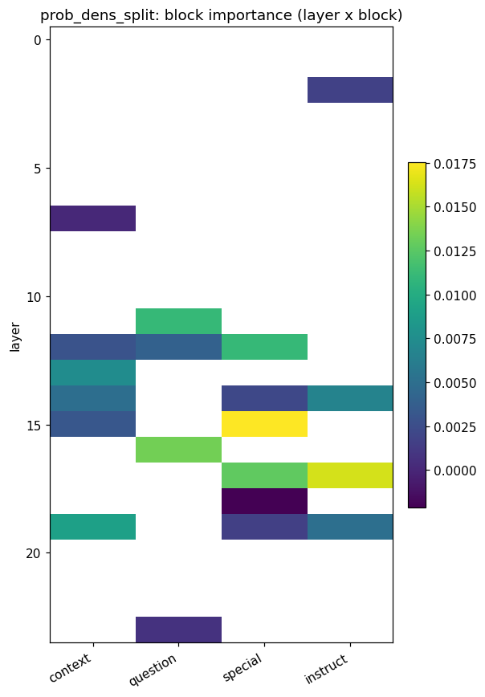
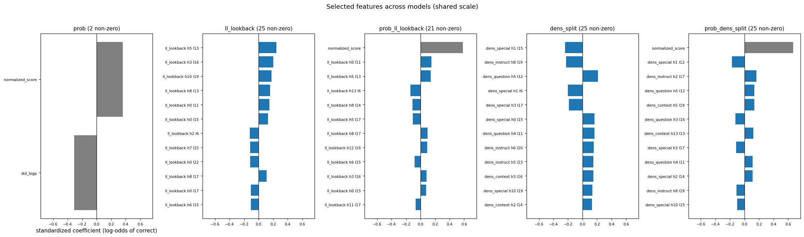
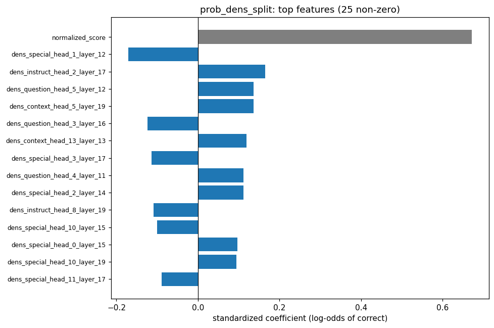
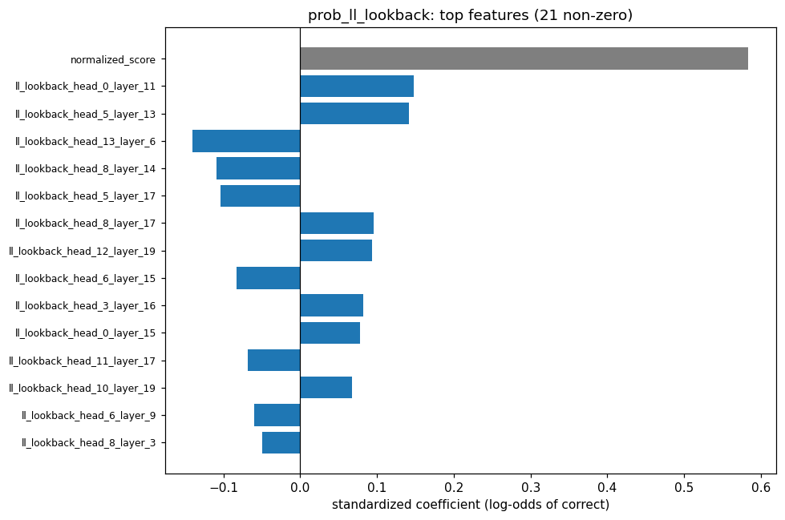
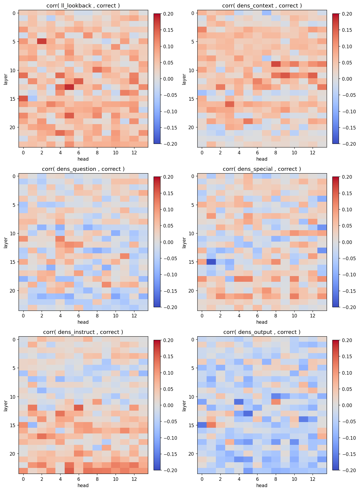

# Attention-based confidence pipeline (SageMaker + S3 + Bedrock)

Python scripts that predict whether Qwen2.5-0.5B's answer is correct, using its attention
allocation and token probabilities, and compare that against a probability-only baseline.
All data lives in S3 under a stage-based layout; all config is in `notebooks/aws_config.py`.

On the test split, the probability + split-density model reaches ROC-AUC **0.790** against
**0.717** for probability alone, and attention features on their own reach **0.754**. The
ordering holds on topics never seen in training (**0.764** vs **0.689**) — see
[Results](#results).

## Layout

```
notebooks/   pipeline steps 01-06 + aws_config.py (run with this as the working directory)
src/         attention_features_v2.py (feature maths), verification_bedrock.py (labels)
tests/       test_features.py — CPU-only unit tests, no AWS needed
docs/img/    figures exported from 06_results.ipynb, shown under Results
data/        local attention dumps and frames (git-ignored)
```

The steps `import aws_config` and `sys.path.append("..")`, so **run everything from
`notebooks/`**; only the tests run from the repo root.

## Setup

1. GPU instance (e.g. `ml.g5.xlarge`) for step 02. Steps 03-06 are CPU-only.
2. `pip install -r requirements.txt`
3. SageMaker execution role needs `bedrock:InvokeModel` + S3 access; enable **Amazon Nova
   Lite** in the Bedrock *Model access* console for your region.
4. `cp .env.example .env` and set `HF_TOKEN` (Qwen download). Optional: `GEN_BATCH_SIZE`,
   `CONFIDENCE_LLM_BUCKET`, `BEDROCK_MODEL_ID`, `MAX_NEW_TOKENS`, `AWS_REGION` — see
   `notebooks/aws_config.py` for all overrides. The `.env` at the repo root is loaded
   automatically; AWS credentials come from the execution role, not from `.env`.
5. Prepare the data: run `01_prepare_data.ipynb` **locally** to curate SQuAD into
   `notebooks/prepared_data/{train,test}.parquet`, then upload them to `raw/{split}.parquet`
   (schema: `id, title, context, question, answer_text, answer_start, prompt`). See the
   notebook's last cell for the upload command.

## Run order

`01_prepare_data.ipynb` runs locally (see Setup 5). The rest run in AWS, from `notebooks/`:

```
python check_tokens.py         # optional preflight: prints token -> region, no GPU/S3 writes
python 02_run_llm.py           # GPU: batched generation + attention dumps
python 04_verification.py      # exact match, Bedrock only on a miss
python 03_extract_features.py  # attention + probability features (03/04 any order)
python 05_train_model.py       # trains the models in cfg.MODEL_CONFIGS
```

then open **`06_results.ipynb`** — model comparison, the seen/unseen topic breakdown,
layer/head correlation heatmaps, L1 coefficients, and grouped permutation importance by
block / layer / layer×block.

Steps 02 and 04 are resumable (already-processed ids are skipped). Step 02 checks the prompt
layout against the region masks on the first sample (`assert_prompt_layout`) and aborts if they
don't match, so a tokenizer mismatch fails in seconds instead of after the full GPU run.
`check_tokens.py` runs the same check on CPU beforehand.

Feature-calculation tests (no AWS, from the repo root): `python -m pytest tests/test_features.py`.

## Method

Given the prompt $x$, the answer $a = M(x)$ that Qwen generates, and the correctness label
$y \in \lbrace 0, 1 \rbrace$, we fit a confidence score $s(x, a) \in [0, 1]$ approximating
$P(y = 1 \mid x, a)$ from features of the model's internal computation while it produced $a$.
The premise — that internal
state predicts correctness better than output probabilities do — comes from Azaria & Mitchell
(2023) and Kadavath et al. (2022); the per-head attention ratio is the one Lookback Lens
(Chuang et al., 2024) defines, applied to a prompt split by token type — see
[References](#references).

### Attention features

Qwen2.5-0.5B-Instruct has $L = 24$ layers and $H = 14$ heads. While generating response token
$t$, let $A^{(l,h)}_{t,j}$ be the attention weight head $(l, h)$ puts on key $j$. The keys are
partitioned into five categories $\mathcal{C}$: the four prompt token types plus the tokens
generated so far.

| Category | Keys it covers |
|---|---|
| `context` | the passage, between the `Context :` and `Question :` markers |
| `question` | `Question :` to the end of the user turn |
| `special` | chat-template control tokens (`<|im_start|>`, `<|im_end|>`, role names) |
| `instruct` | everything else in the prompt — system message, instruction, markers |
| `output` | the response tokens generated before `t` |

For each token, the attention on a category $c$ is summed and divided by $n_c$, the number of
tokens in that category, giving the attention *density* per token; the five densities are then
renormalized to sum to 1:

$$
A^{(l,h)}_c(t) = \frac{1}{n_c}\sum_{j \in c} A^{(l,h)}_{t,j}
\qquad
d^{(l,h)}_c(t) = \frac{A^{(l,h)}_c(t)}{\sum_{c' \in \mathcal{C}} A^{(l,h)}_{c'}(t)}
$$

Dividing by $n_c$ is what makes the feature independent of length. A raw share of the attention
row rises with the size of the group simply because there are more keys in it, so it would move
with passage and answer length even for a head whose behaviour never changes; a density does not.
Under perfectly uniform attention — no preference at all — every $d_c$ is exactly $1/5$ whatever
the lengths, which is what `tests/test_features.py` asserts.

The feature is the mean of that density over the $T$ response tokens,

$$
\bar{d}^{(l,h)}_c = \frac{1}{T-1} \sum_{t = 1}^{T-1} d^{(l,h)}_c(t)
$$

which is the column `dens_{c}_head_{h}_layer_{l}` in the feature frames. The sum starts at
$t = 1$ because at $t = 0$ nothing has been generated yet, so the `output` group is empty and its
density is undefined (difference 2 below); a one-token answer is the exception, where that single
step is kept and its `output` density is 0. Since the five densities sum to 1, the
$c = \text{output}$ column is dropped at modelling time as the reference category, which avoids
the dummy-variable trap and leaves $4 \times 24 \times 14 = 1344$ columns.

The **lookback ratio** is the same quantity over two groups — the whole prompt against the
model's own output — which is Lookback Lens's own statistic:

$$
\ell^{(l,h)}(t) = \frac{A^{(l,h)}_{\text{prompt}}(t)}{A^{(l,h)}_{\text{prompt}}(t) + A^{(l,h)}_{\text{output}}(t)}
$$

$$
A^{(l,h)}_{\text{prompt}}(t) = \frac{1}{n_{\text{prompt}}}\sum_{c \neq \text{output}} \sum_{j \in c} A^{(l,h)}_{t,j}
\qquad
A^{(l,h)}_{\text{output}}(t) = \frac{1}{t}\sum_{j \in \text{output}} A^{(l,h)}_{t,j}
$$

where $n_{\text{prompt}} = \sum_{c \neq \text{output}} n_c$ pools the whole prompt into one group,
and the step index $t$ doubles as the number of tokens generated before it. Averaged over the
response tokens the same way, this gives `ll_lookback_head_{h}_layer_{l}` — 336 more columns.


Categories are located by searching for the `Context :` / `Question :` markers rather than by
fixed token offsets, so the masks hold across tokenizer and `transformers` versions.

### Probability features

Five aggregates of the generated tokens' probabilities $p_t$ — the standard softmax-confidence
heuristics (Kadavath et al., 2022) that the attention features are compared against:

| Feature | Definition | Meaning |
|---|---|---|
| `normalized_score` | $\frac{1}{T}\sum_{t=1}^{T} \log p_t$ | mean log-probability per token, so the score is not just a function of answer length |
| `prod_score` | $\prod_{t=1}^{T} p_t$ | sequence likelihood |
| `min_score` | $\min_t p_t$ | the least-confident token — a weakest-link signal |
| `std_logp` | $\sigma(\log p_t)$ | how uneven confidence is across the answer |
| `len_output` | $T$ | number of generated tokens |

### Labels

`src/verification_bedrock.py`. First, SQuAD-style normalized exact match: lowercase, strip
punctuation and articles, and count it correct if the gold answer equals or appears in the
generated answer. Only the misses go to Bedrock (Nova Lite via `converse`, `temperature=0`),
which judges semantic equivalence given context, question, gold answer and generated answer.
`verify_method` records which path produced each label, so the API is billed only for the
answers exact match cannot settle.

### Confidence model

L1-penalized logistic regression on standardized features ($C = 10^{-2}$,
`class_weight="balanced"`), chosen so each non-zero coefficient is a signed per-standard-deviation
contribution to the log-odds of a correct answer. Features are picked by greedy forward
selection from an **empty** model: at each step every remaining candidate is scored by 5-fold
cross-validated ROC-AUC when added to the current set, the best is kept, and this repeats up to
25 features; selection also stops early as soon as no remaining candidate improves the
cross-validated score. Starting empty lets probability and attention features compete on equal
footing.

### Metrics

ROC-AUC and AUPRC for discrimination, and for calibration the Brier score and the expected
calibration error over $B = 10$ equal-width bins:

$$
\text{Brier} = \frac{1}{N}\sum_{i=1}^{N}\left(s_i - y_i\right)^2
\qquad
\text{ECE} = \sum_{b=1}^{B} \frac{n_b}{N}\,\bigl\lvert \text{acc}(b) - \text{conf}(b) \bigr\rvert
$$

where $n_b$ is the number of answers whose score falls in bin $b$, $\text{acc}(b)$ their observed
fraction correct, and $\text{conf}(b)$ their mean predicted score.

## Models (step 05, `cfg.MODEL_CONFIGS`)

The models differ only in which feature blocks they may draw from:

| Block | What it is | Candidate columns |
|---|---|---|
| `prob` | the five probability aggregates | 5 |
| `ll_lookback` | per-(layer, head) Lookback Lens ratio — the whole prompt against the model's own output | 336 (24 × 14) |
| `dens_split` | the same attention kept split by token type (context / question / special / instruct) | 1344 (4 × 24 × 14) |

| Model | Blocks | What it tests |
|---|---|---|
| `prob` | `prob` | the token-probability baseline |
| `ll_lookback` | `ll_lookback` | whether Lookback Lens's own statistic predicts correctness on its own |
| `prob_ll_lookback` | `prob` + `ll_lookback` | what that aggregate ratio adds to probability |
| `dens_split` | `dens_split` | whether attention alone, without probabilities, beats the baseline |
| `prob_dens_split` | `prob` + `dens_split` | what token-type-split attention adds to probability |

All are fitted with the identical procedure above, so the comparison is about features rather
than tuning. The pairing is deliberate: `ll_lookback` and `dens_split` are the same attention
under the same per-token normalization, differing in whether the prompt is pooled into one group
or kept as four — so the gap between them is close to a clean read on what the token-type split
is worth. Close, not exact, for the reason given under
[Attention features](#attention-features): the pooled and split densities use different
divisors.

## Results

Numbers below are the stored outputs of `06_results.ipynb` for one full run —
Qwen2.5-0.5B-Instruct on curated SQuAD v1.1: **6,620 train** questions over 31 topics and
**1,056 test** questions over 33 topics (12 seen in training, 21 unseen). Qwen answers
**81.0%** of the test questions correctly.

| Model | ROC-AUC | AUPRC | Brier | ECE |
|---|---|---|---|---|
| `prob` — pure probability | 0.717 | 0.909 | 0.227 | 0.294 |
| `ll_lookback` — Lookback Lens ratio only | 0.718 | 0.915 | 0.224 | 0.287 |
| `prob_ll_lookback` — probability + lookback ratio | 0.749 | 0.924 | 0.216 | 0.282 |
| `dens_split` — attention densities only | 0.754 | 0.924 | 0.207 | 0.268 |
| **`prob_dens_split` — probability + attention densities** | **0.790** | **0.940** | **0.193** | **0.253** |

The probability + split-density model is best on every column: it discriminates better (ROC-AUC,
AUPRC) and is closer to calibrated (Brier, ECE) than any other feature combination. The AUPRC
floor here is the 0.810 base rate, so the AUPRC column separates the models less than ROC-AUC
does.



- `prob_dens_split` is 0.073 ROC-AUC above `prob`, the largest gap in the table, so the
  attention densities add signal the probabilities do not already contain.
- Splitting attention by token type beats the aggregate two-group ratio at both ends:
  `dens_split` 0.754 vs `ll_lookback` 0.718, and `prob_dens_split` 0.790 vs `prob_ll_lookback`
  0.749.
- `dens_split` (0.754) is above `prob` (0.717) using no probability features at all.
- `ll_lookback` (0.718) lands level with the probability baseline (0.717) on its own, and adding
  it to `prob` gains 0.03 — under half of the 0.073 the split densities add.

### Seen vs unseen topics

Test questions split by whether their Wikipedia title also appears in the train split: **seen**
(n = 306, base rate 0.814) means the topic was trained on and only the questions are held out;
**unseen** (n = 750, base rate 0.808) means the topic never appeared in training. Unseen is the
honest out-of-distribution check.

| Model | ROC-AUC seen | ROC-AUC unseen | Δ | AUPRC seen | AUPRC unseen |
|---|---|---|---|---|---|
| `prob` | 0.784 | 0.689 | −0.096 | 0.938 | 0.896 |
| `ll_lookback` | 0.768 | 0.699 | −0.069 | 0.940 | 0.904 |
| `prob_ll_lookback` | 0.829 | 0.716 | −0.113 | 0.957 | 0.911 |
| `dens_split` | 0.779 | 0.745 | −0.034 | 0.938 | 0.918 |
| **`prob_dens_split`** | **0.854** | **0.764** | −0.090 | **0.962** | **0.932** |



- The ranking is unchanged out of distribution: `prob_dens_split` (0.764) > `dens_split` (0.745)
  > `prob_ll_lookback` (0.716) > `ll_lookback` (0.699) > `prob` (0.689).
- The attention-only models degrade least: `dens_split` loses 0.034 and `ll_lookback` 0.069,
  while every model containing probability features loses more (0.090, 0.096 and 0.113).
- The `prob_dens_split` − `prob` gap is wider on unseen topics (0.076) than on seen ones (0.070).
- Attention alone still beats probability alone out of distribution: `dens_split` 0.745 vs `prob`
  0.689.
- Base rates are near-identical across the two cohorts (0.814 vs 0.808), so Qwen is not simply
  worse at unseen topics — what degrades is how predictable its errors are.

### Which feature blocks the model relies on

Grouped permutation importance on `prob_dens_split` — the drop in test ROC-AUC when a whole block
of features is shuffled together, from a base of 0.790. Shuffling a block rather than a single
column allows looking at effect of the upper level of feature heirarchy (i.e at prompt token type and layer level).



```
probability  0.182      layers:  17  0.031
question     0.044               15  0.023
special      0.039               12  0.021
instruct     0.028               19  0.018
context      0.019               16  0.015
```

Probability is by far the strongest single block, about 4× the largest attention block. Among the
attention categories `question` is the largest, followed by `special` and `instruct`, with
`context` last — the passage the answer is copied from is the *least* important of the four by
this measure. The layer plot puts the attention signal in layers 11-19,
peaking at 17; the early layers and the last four contribute close to nothing.

Broken out by layer and block — white cells are (layer, block) pairs where forward selection
picked no feature, so only the 25 selected features appear:



The two brightest cells are `special` at layer 15 and `instruct` at layer 17, followed by
`question` at layer 16. `special` and `context` are each spread over six layers (`special` at 12,
14, 15, 17, 18, 19; `context` at 7, 12, 13, 14, 15, 19), `question` and `instruct` over four —
but no `context` cell is ever bright, which is why it sits bottom of the block chart while
`special` is second among the attention blocks. The darkest square, `special` at layer 18, is
slightly negative — noise around zero.

### Selected features and coefficients

Standardized L1 coefficients of the features forward selection kept, as log-odds of a correct
answer; grey is probability, blue is attention. With `C = 1e-2` the penalty is strong, so
magnitudes are small throughout.



The five models side by side on one x-scale. Non-zero counts: `prob` 2, `ll_lookback` 25,
`prob_ll_lookback` 21, `dens_split` 25, `prob_dens_split` 25 — the selection cap is 25, so every
attention model saturates it while `prob` keeps just two of its five aggregates
(`normalized_score` positive, `std_logp` negative).



In `prob_dens_split`, `normalized_score` (≈ +0.67) is around four times larger than any attention
coefficient, all of which sit within ±0.17. Signs are mixed within a single category —
`dens_question_head_5_layer_12` is positive and `dens_question_head_3_layer_16` negative, and
`special` appears with both signs at layers 15 and 17 — so the coefficients do not support a
simple "more attention here means correct" rule in either direction. The largest attention
coefficient of all is `dens_special_head_1_layer_12` at ≈ −0.17; the two `dens_context` features
in the top 15 are both positive. What the block importance above shows is how much a block
matters jointly, not a direction.



`prob_ll_lookback` leans on probability too: `normalized_score` (≈ +0.58) dwarfs 20 small
`ll_lookback_*` coefficients, none above ≈0.15 in magnitude and mixed in sign. That matches its
0.03 gain over `prob` alone — collapsing the prompt into a single ratio per head leaves little
for the classifier to work with beyond what the probabilities already say. Fitted on its own,
without probability features, `ll_lookback` has six largest coefficients which are all
positive (`ll_lookback_head_5_layer_13` ≈ +0.24, `head_3_layer_16` ≈ +0.20, `head_10_layer_19`
≈ +0.17), i.e. a head that keeps attending to the prompt rather than to its own output predicts a
correct answer.

### Correlation by layer and head

Point-biserial correlation between each individual `(layer, head)` feature and correctness, per
block. This is a univariate view — no model, no feature selection — so it shows where the raw
signal sits before anything is fitted. The correlations are small throughout (|r| ≤ 0.2).

<details>
<summary>Show the six heatmaps (tall image)</summary>



</details>

`ll_lookback` is positive almost everywhere — warm across nearly the whole grid, with its
strongest cells scattered around layers 5, 12-13 and 18 — so at the univariate level, attending
to the prompt rather than to the generated answer is a mild positive sign wherever you look.
`dens_output` is its mirror image, negative nearly everywhere and most so in layers 10-23.

Among the split categories, `dens_context` is positive through the first half of the network,
strongest in a band at layers 9-13 in the higher-numbered heads, and mostly negative from layer
15 up. `dens_instruct` runs the other way: weak early, positive across layers 12-18 and strongly
positive in the last two layers. `dens_special` is negative around layers 10-17 and positive in
18-22. `dens_question` is weak and mixed everywhere.

The univariate and multivariate views disagree about `question`: it has almost no standalone
correlation, yet it is the largest attention block in the permutation importance. It carries
signal only in combination with the other features — which is the case for splitting attention by
token type rather than screening categories one at a time.

### Caveats

- The outputs rank answers, they are not calibrated probabilities (ECE 0.25-0.29). A score of
  0.73 does not mean a 73% chance of being correct; fit a Platt or isotonic calibrator if you
  need that. `class_weight="balanced"` with a fixed 0.5 threshold also makes accuracy at that
  threshold a poor summary — always answering "correct" already scores 0.810 — so tune the
  threshold on a validation split before using the scores in a decision rule.
- These are one train/test split with no confidence intervals, and forward selection over highly
  correlated attention features is unstable across resamples, so the ranking of individual heads
  and layers is qualitative. The seen/unseen split is a topic-level holdout within SQuAD, not a
  separate dataset; generalisation to another QA distribution is untested.
- Everything is one 0.5B model on extractive QA with the passage in the prompt, where "attend to
  the context" is a meaningful thing to measure. Nothing here shows the same features work
  closed-book or at larger scale.

Figures are exported from `06_results.ipynb`; re-run the notebook and re-export to
`docs/img/` after any change to the pipeline.

## S3 layout (`s3://<bucket>/confidence-llm/`)

| Stage | Path | Written by |
|---|---|---|
| raw input | `raw/{split}.parquet` | you |
| per-sample dumps | `samples/{split}/{id}.npz` (cat_ratios, scores, tokens) | 02 |
| generation | `generation/{split}.parquet` | 02 |
| verification labels | `verification/{split}.parquet` (`id, is_correct, verify_method`) | 04 |
| features | `features/{split}_attention.parquet`, `features/{split}_probability.parquet` | 03 |
| models | `models/{name}.joblib` (one per config) | 05 |
| predictions | `results/{split}_{name}.parquet` (`id, pred, is_correct`) | 05 |

Bucket defaults to `sagemaker-<region>-<account>` and the prefix to `confidence-llm`; both are
overridable via `.env`.

## References

The closest precedent is Lookback Lens — a light classifier over per-head attention ratios. The
shared idea is a per-(layer, head) attention ratio averaged over the response tokens and fed to a
linear classifier, and the ratio here is theirs: attention on a group divided by the *number of
tokens in that group*, so it is a per-token density invariant to how long the passage and the
answer are. This is not a reimplementation of their pipeline, though. The main departure is the
token-type split — Lookback Lens treats the whole prompt as one undivided "context", whereas
`dens_*` keeps four prompt token-types apart and `ll_lookback_*` reproduces their two-group ratio
alongside it for comparison.

1. **Chuang et al. (2024)** — *Lookback Lens: Detecting and Mitigating Contextual Hallucinations
   in Large Language Models Using Only Attention Maps.* EMNLP 2024.
   [arXiv:2407.07071](https://arxiv.org/abs/2407.07071) ·
   [ACL Anthology](https://aclanthology.org/2024.emnlp-main.84/).
   A linear classifier on the per-head lookback ratio (attention on context vs. on generated
   tokens) detects contextual hallucinations as well as full-hidden-state detectors, and
   transfers across tasks and model sizes. The `ll_lookback` block is that ratio, computed with
   the whole prompt as the context group; `tests/test_features.py` pins the per-token formula
   against a transcription of their reference implementation.

2. **Yuksekgonul et al. (2024)** — *Attention Satisfies: A Constraint-Satisfaction Lens on
   Factual Errors of Language Models.* ICLR 2024.
   [arXiv:2309.15098](https://arxiv.org/abs/2309.15098) ·
   [OpenReview](https://openreview.net/forum?id=gfFVATffPd).
   Finds a positive relationship between attention on the relevant constraint tokens and factual
   accuracy, and reads factual errors off those patterns (SAT Probe). The motivation for
   splitting the input attention by token type, which is what separates `dens_split` from
   `ll_lookback` in the results above — though the split that pays here is not the one this
   predicts: `context` is the *weakest* of the four blocks by permutation importance, not the
   strongest.

3. **Azaria & Mitchell (2023)** — *The Internal State of an LLM Knows When It's Lying.* Findings
   of EMNLP 2023. [arXiv:2304.13734](https://arxiv.org/html/2304.13734) ·
   [ACL Anthology](https://aclanthology.org/2023.findings-emnlp.68/).
   A classifier on hidden-layer activations predicts statement truth more reliably than the
   model's own output probability, which is confounded by length and word frequency. The same
   white-box idea applied to hidden states rather than attention.

4. **Kadavath et al. (2022)** — *Language Models (Mostly) Know What They Know.*
   [arXiv:2207.05221](https://arxiv.org/abs/2207.05221).
   Study of self-confidence and calibration from output probabilities — the signal behind the
   `prob` baseline and the reason ECE is reported alongside ROC-AUC.
